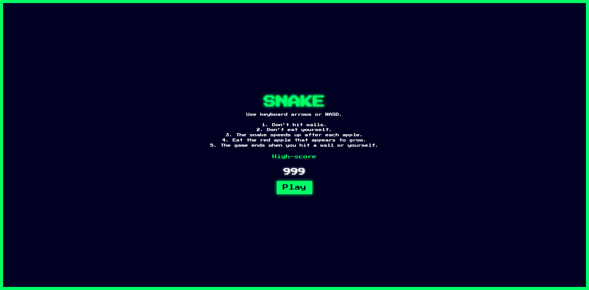

# 🐍 Snake Game

## 📌 About

A classic Snake game where you control a snake to eat apples while avoiding walls and your own tail.

## 🎮 How to Play

1. Open `index.html` in any browser
2. Use arrow keys or WASD on desktop
3. Use on-screen arrows on mobile devices
4. Eat 🍎 apples to grow longer and increase your score
5. Game ends if you hit a wall or your own tail

## ✨ Game Features

- 🏆 High score tracking with browser storage
- 🚀 Snake speeds up after each apple
- 📱 Responsive design for both desktop and mobile
- 👆 Touch controls that hide in landscape mode

## 📂 Files

- `index.html` - Game structure
- `styles.css` - Game styling
- `script.js` - Game logic